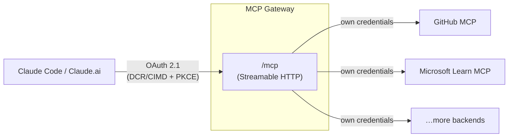
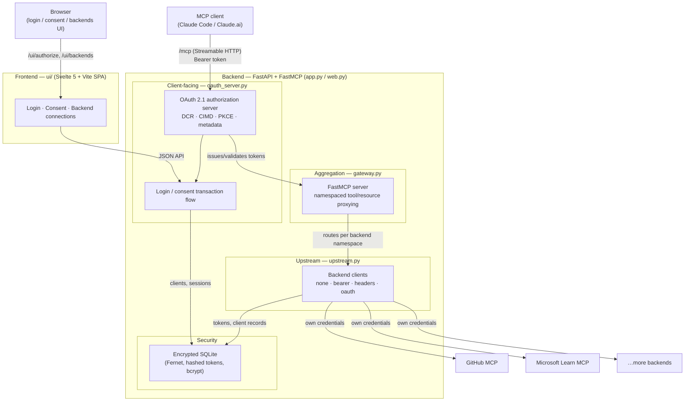

# MCP Gateway

A lightweight, self-hosted **MCP aggregator gateway**: one public MCP endpoint in front
of any number of protected backend MCP servers, with a **spec-compliant OAuth 2.1
authorization server facing the MCP client** — the piece most existing gateways are
missing.



Built with **FastAPI + FastMCP**, configured by a **single YAML file**, stores its state
in a single encrypted SQLite database, and ships as one small standalone container —
no reverse proxy required, though you can put one in front of it for TLS. Prebuilt
images are published at
[`ghcr.io/r0wi/mcp-gateway`](https://github.com/R0Wi/mcp-gateway/pkgs/container/mcp-gateway);
building from source is only needed if you want to change the code.

## Features

**Client-facing (MCP authorization spec, 2025-11-25):**

- OAuth 2.1 authorization code flow with mandatory **PKCE (S256)**
- **Dynamic Client Registration** (RFC 7591) at `/register` — `claude mcp add` works
  with no pre-shared credentials
- **Client ID Metadata Documents (CIMD)** — HTTPS URLs as client IDs, including
  `private_key_jwt` client authentication, advertised via
  `client_id_metadata_document_supported: true`
- **Authorization Server Metadata** (RFC 8414) + OIDC discovery alias
- **Protected Resource Metadata** (RFC 9728); 401 responses carry
  `WWW-Authenticate: Bearer resource_metadata="…"` as Claude's connector requires
- Resource indicators (RFC 8707) accepted and bound to issued tokens
- Short-lived opaque access tokens, **rotating refresh tokens**, single-use
  authorization codes — all stored **hashed**; client records encrypted at rest
- Loopback redirect URIs match **port-agnostically** (Claude Code CLI registers one
  port and authorizes with another); non-loopback URIs require exact registration
- Small **Svelte 5** login + consent UI — local users from the config file, an
  external **OpenID Connect provider** (Pocket ID, Authentik, Keycloak, Entra ID, …),
  or both side by side

**Backend-facing:**

- `none` — public servers (e.g. Microsoft Learn MCP)
- `bearer` — static token injection (`Authorization: Bearer …`, e.g. PATs)
- `headers` — arbitrary static headers (API keys)
- `oauth` — full OAuth client per the MCP spec: metadata discovery, **CIMD when the
  upstream AS supports it** (the gateway hosts its own client metadata document),
  **DCR fallback**, PKCE, automatic token refresh. Connected once via the browser;
  tokens persisted encrypted (Fernet) in SQLite.
- The client's gateway token is **never** forwarded upstream (no token passthrough,
  as the spec demands); backends only ever see credentials the gateway holds.

**Aggregation:**

- Tools/resources/prompts namespaced per backend: `github_create_issue`,
  `msdocs_microsoft_docs_search`, …
- Live proxying over Streamable HTTP; a down or not-yet-connected backend only
  removes its own tools instead of breaking the gateway
- Built-in `gateway_status` tool

## Quick start

```bash
cp config.example.yaml config.yaml
$EDITOR config.yaml                                   # set public_url, users, backends
cp .env.example .env
$EDITOR .env                                           # set MCP_GATEWAY_ENCRYPTION_KEY (openssl rand -base64 32)
docker compose up -d
```

`docker compose up -d` pulls the prebuilt
[`ghcr.io/r0wi/mcp-gateway`](https://github.com/R0Wi/mcp-gateway/pkgs/container/mcp-gateway)
image by default — no build step required. If you want to run from source instead
(e.g. to test local changes), uncomment the `build: .` line in `docker-compose.yml` and
comment out `image:`.

The gateway runs standalone and listens on `:8000`; `docker compose` picks up
`MCP_GATEWAY_ENCRYPTION_KEY` from `.env` automatically. Put it behind a reverse proxy of
your choice for TLS, or expose the port directly. For a file-based alternative to
`.env` (recommended for production), see [Encryption key](#encryption-key).

Generate a password hash for the config file:

```bash
docker compose run --rm mcp-gateway mcp-gateway hash-password
```

### Connect Claude Code (CLI)

```bash
claude mcp add --transport http gateway https://mcp.example.com/mcp
```

Claude Code discovers the gateway's authorization server, registers itself via DCR (or
uses its CIMD client ID), and opens your browser: log in with a user from
`config.yaml`, approve, done. No tokens to paste.

### Connect Claude.ai / Claude Code web (custom connector)

Add `https://mcp.example.com/mcp` as a custom connector. The browser redirect to
`https://claude.ai/api/mcp/auth_callback` goes through the same login/consent flow.

### Connect OAuth backends

Open `https://mcp.example.com/ui/backends`, sign in, and press **Connect** next to each
OAuth backend (e.g. GitHub MCP). You'll be redirected to the backend's authorization
server once; afterwards the gateway refreshes tokens automatically.

## Configuration

Everything lives in one YAML file (see [`config.example.yaml`](config.example.yaml)).
Values support `${ENV_VAR}` / `${ENV_VAR:-default}` expansion.

```yaml
server:
  public_url: https://mcp.example.com   # behind your reverse proxy

auth:
  encryption_key: ${MCP_GATEWAY_ENCRYPTION_KEY}   # encrypts secrets at rest
  users:
    - username: admin
      password_hash: "$2b$12$…"          # mcp-gateway hash-password
  oidc:                                  # optional; see "Logging in with an IdP"
    issuer: https://id.example.com
    client_id: ${OIDC_CLIENT_ID}
    client_secret: ${OIDC_CLIENT_SECRET}
  access_token_expiry_seconds: 3600
  refresh_token_expiry_seconds: 2592000

storage:
  path: /data/gateway.db                 # SQLite; the only state

backends:
  github:                                # → tools namespaced github_*
    url: https://api.githubcopilot.com/mcp/
    auth:
      type: oauth
      # GitHub's authorization server supports neither CIMD nor DCR, so
      # register a GitHub OAuth App and provide its credentials directly:
      client_id: ${GITHUB_OAUTH_CLIENT_ID}
      client_secret: ${GITHUB_OAUTH_CLIENT_SECRET}
  microsoft-docs:                        # → tools namespaced microsoft-docs_*
    url: https://learn.microsoft.com/api/mcp
    auth: { type: none }
  something-with-a-pat:
    url: https://example.com/mcp
    auth: { type: bearer, token: "${SOME_PAT}" }
```

Adding a backend is config-only — no code changes.

### Logging in with an identity provider (OIDC)

By default the consent screen is guarded by the local users in `auth.users`. Set
`auth.oidc` to have the browser log in through an external OpenID Connect provider
instead — the identity it returns becomes the gateway session's user, and that
session is what approves MCP clients.

This is the **client-facing** login only. It is unrelated to
`backends.*.auth.type: oauth`, which is how the gateway authenticates *itself*
against upstream MCP servers; the two legs never share credentials or storage.

```yaml
auth:
  users: []                                # optional: no local login at all
  oidc:
    issuer: https://id.example.com         # endpoints come from its discovery document
    client_id: ${OIDC_CLIENT_ID}
    client_secret: ${OIDC_CLIENT_SECRET}   # omit for a public (PKCE-only) client
    scopes: ["openid", "profile", "email", "groups"]
    display_name: Pocket ID                # button label: "Continue with Pocket ID"
    username_claim: preferred_username     # falls back to "sub"
    allowed_groups: ["mcp-admins"]         # optional allow-list (groups_claim: groups)
    # allowed_users: ["alice"]
```

Register the gateway at your provider as an OAuth client whose callback URL is
`<public_url>/auth/oidc/callback`, and enable PKCE if the provider makes it optional.

| Key | Default | Notes |
| --- | --- | --- |
| `issuer` | – | Endpoints are discovered from `<issuer>/.well-known/openid-configuration` |
| `client_id` / `client_secret` | – | Secret optional; without it the gateway is a public client (PKCE only) |
| `scopes` | `["openid", "profile", "email"]` | `openid` is added if you leave it out |
| `username_claim` | `preferred_username` | Claim used as the gateway username |
| `groups_claim` | `groups` | Claim read for `allowed_groups` |
| `allowed_users` / `allowed_groups` | unset | Allow-lists; with neither, anyone the provider authenticates for this client may log in |
| `display_name` | `SSO` | Sign-in button label |
| `enabled` | `true` | Set `false` to keep the config but turn the provider off |
| `authorization_endpoint`, `token_endpoint`, `jwks_uri` | unset | Set all three to skip discovery |

Leaving `auth.users` empty removes the password form entirely, so the provider is the
only way in; keeping both configured shows the password form *and* a
"Continue with …" button. Configure at least one of the two — a config with neither is
rejected at startup.

What the gateway trusts is the **ID token**, and only after verifying it: the
signature against the provider's JWKS (asymmetric algorithms only — `HS*` and `none`
are refused whatever the provider advertises), `iss`, `aud`, `exp`, and the `nonce`
bound to that browser's login. The access token the provider issues alongside it is
never used or stored — the gateway wants an identity, not API access. The PKCE
verifier and nonce ride along in a short-lived signed, HttpOnly cookie, which also
makes the `state` check per-browser.

Both routes (`/auth/oidc/login`, `/auth/oidc/callback`) return 404 when `auth.oidc`
is unset, so a gateway without a provider exposes no extra surface.

### Backend auth reference

| type      | fields                          | behaviour                                                            |
| --------- | ------------------------------- | -------------------------------------------------------------------- |
| `none`    | –                               | no credentials sent                                                   |
| `bearer`  | `token`                         | `Authorization: Bearer <token>` on every request                      |
| `headers` | `headers: {Name: value}`        | static headers (API keys etc.)                                        |
| `oauth`   | `scopes`, `prefer_dcr`, `client_id`, `client_secret` | full OAuth client: CIMD → DCR fallback, PKCE, refresh, encrypted store |

For `oauth` backends the gateway hosts its own Client ID Metadata Document at
`<public_url>/oauth/client-metadata.json` and uses it as its client ID whenever the
upstream AS advertises CIMD support (requires an HTTPS `public_url`); otherwise it
falls back to Dynamic Client Registration. If the upstream AS supports neither (e.g.
GitHub's), set `client_id` (and `client_secret`, if the app is confidential) to use a
pre-registered OAuth client instead — CIMD/DCR are skipped entirely.

### Encryption key

`auth.encryption_key` protects everything the gateway stores at rest: registered
OAuth client records and upstream backends' access/refresh tokens (see
[Security](#security) for how). Two ways to supply it:

- **`MCP_GATEWAY_ENCRYPTION_KEY`** (default) — a plain environment variable,
  referenced from `config.yaml` as `${MCP_GATEWAY_ENCRYPTION_KEY}`. Simple, and fine
  for a self-hosted single-admin deployment.
- **`MCP_GATEWAY_ENCRYPTION_KEY_FILE`** — path to a file containing the key,
  e.g. `/run/secrets/encryption_key`. Takes precedence over
  `MCP_GATEWAY_ENCRYPTION_KEY` when set, and `config.yaml` doesn't need any change
  either way. This is the [Docker Compose `secrets:`
  convention](https://docs.docker.com/compose/how-tos/use-secrets/) — it keeps the
  raw key out of `docker inspect` and `docker compose config` output, and is what
  Kubernetes `Secret` volumes, Vault Agent, and most KMS sidecars all expect too.
  `docker-compose.yml` has a commented-out example; switching is a few uncommented
  lines, no rebuild required.

Internally, the key you supply is a **Key Encryption Key (KEK)**: it never encrypts
data directly. On first run the gateway generates a random Data Encryption Key (DEK)
that does the actual encrypting, and stores the DEK wrapped by the KEK. This means
rotating `encryption_key` only has to re-wrap that one small DEK, not re-encrypt the
whole database:

```bash
openssl rand -base64 32 > new-key.txt
mcp-gateway rotate-key -c config.yaml --old-key-file old-key.txt --new-key-file new-key.txt
```

This updates the database in place (an O(1) operation, regardless of how much data
it holds); update `MCP_GATEWAY_ENCRYPTION_KEY`/`MCP_GATEWAY_ENCRYPTION_KEY_FILE` to
`new-key.txt`'s contents and restart the gateway afterwards. If `--old-key-file`
doesn't match the key currently protecting the database, the command fails with an
error and changes nothing.

#### If you lose the key

There is no recovery path — that's what "encrypted" means. Every registered OAuth
client would need to re-register (most do this automatically via DCR/CIMD on next
use) and every OAuth backend would need reconnecting via `/ui/backends`. Back the key
up the way you'd back up any other irreplaceable credential — a password manager, a
sealed secret in your org's vault — not just as a file that only exists on the host
running the gateway.

## Database migrations

Schema changes are managed with [Alembic](https://alembic.sqlalchemy.org/) (migration
scripts live in `src/mcp_gateway/migrations/`). `mcp-gateway run` applies any pending
migrations automatically before the server starts -- this covers both a brand-new
database (created from scratch on first run) and upgrading an older one, so there's
nothing to do for a normal deployment.

If you'd rather apply migrations as an explicit step -- e.g. as part of a deploy
pipeline, or before scaling up multiple replicas against the same database -- run:

```bash
mcp-gateway migrate -c config.yaml
```

This only touches the database (it doesn't start the server) and is safe to run
before *and* after `mcp-gateway run`: migrations are idempotent and tracked in the
database itself (an `alembic_version` table), so applying them twice, or having both
`migrate` and the next `run` see an already-up-to-date database, is a no-op.

## Logging

The gateway logs to stdout/stderr (`docker logs`, `docker compose logs -f`), at `INFO` by
default: startup/shutdown, config summary, login attempts, OAuth authorize/consent/token
issuance, upstream backend connect/disconnect, and backend mount status. `DEBUG` adds
finer-grained detail (client construction, token rotation, CIMD refreshes, storage
housekeeping). No credentials or tokens are ever logged, at any level.

Set the level via the `MCP_GATEWAY_LOG_LEVEL` environment variable (`debug`, `info`,
`warning`, `error`, or `critical`):

```bash
# .env (picked up by docker compose)
MCP_GATEWAY_LOG_LEVEL=debug
```

```bash
# or inline
docker compose run --rm -e MCP_GATEWAY_LOG_LEVEL=debug mcp-gateway
```

`docker-compose.yml` already forwards this variable to the container, defaulting to
`info` when unset.

Outside Docker, `--log-level` on `mcp-gateway run` works the same way and takes
precedence over the env var:

```bash
mcp-gateway run -c config.yaml --log-level debug
```

## Endpoints

| Path                                          | Purpose                                        |
| --------------------------------------------- | ---------------------------------------------- |
| `/mcp`                                        | MCP endpoint (Streamable HTTP)                 |
| `/.well-known/oauth-protected-resource[/mcp]` | RFC 9728 protected resource metadata           |
| `/.well-known/oauth-authorization-server`     | RFC 8414 AS metadata (+ OIDC alias)            |
| `/authorize`, `/token`, `/register`, `/revoke`| OAuth 2.1 endpoints (PKCE, DCR, revocation)    |
| `/ui/authorize`                               | login + consent (Svelte 5)                     |
| `/auth/oidc/login`, `/auth/oidc/callback`     | identity-provider login (404 unless `auth.oidc` is set) |
| `/ui/backends`                                | backend connection status / connect / disconnect |
| `/oauth/client-metadata.json`                 | the gateway's own CIMD document (upstream leg) |
| `/oauth/connect/<backend>`, `/oauth/callback` | upstream OAuth connect flow                    |
| `/healthz`                                    | liveness                                       |

## Security

A quick tour of the primitives in use and what they're for, before the detailed list
below:

- **Secrets at rest** (registered OAuth client records, upstream backends'
  access/refresh tokens) are encrypted with **Fernet** — AES-128-CBC plus
  HMAC-SHA256, authenticated symmetric encryption from Python's well-audited
  `cryptography` package, not hand-rolled crypto. See [Encryption
  key](#encryption-key) for how the key itself is supplied, wrapped (envelope
  encryption), and rotated.
- **Passwords**: local users' passwords are hashed with **bcrypt**
  (`mcp-gateway hash-password`); a passphrase-style `encryption_key` is stretched
  into a Fernet key with **scrypt** (`n=2**17`, current OWASP guidance) plus a random
  per-database salt, rather than used directly.
- **Tokens**: access/refresh tokens and authorization codes are never stored in
  recoverable form — only a **SHA-256 hash** of each, the same way a password would be.
- **Sessions**: browser login sessions are signed cookies (**itsdangerous**), not
  server-side session IDs, but are still revocable — logout records the session in
  SQLite so it stops validating immediately, not just when the cookie expires.

None of this protects a fully compromised gateway process — a key that's *decrypting
and using* secrets on every request necessarily has to be in that process's memory.
What it protects against is the database file leaking *without* the process: a
misdirected backup, a shared volume snapshot, a support bundle.

### Hardening measures

- PKCE (S256) is mandatory; authorization codes are single-use and expire in 5 min.
- Refresh tokens rotate on every use (OAuth 2.1 public-client requirement).
- The consent screen names the client and the exact redirect target, and warns on
  loopback redirects (CIMD localhost-impersonation guidance from the spec).
- Tokens issued to MCP clients are never forwarded to backends, and backend
  credentials never reach MCP clients.
- Sessions are `HttpOnly`, `SameSite=Lax`, `Secure` on HTTPS.
- OIDC logins verify the ID token's signature against the provider's JWKS (asymmetric algorithms only), plus `iss`, `aud`, `exp` and a per-browser `nonce`; the discovery document's issuer must match the configured one, and post-login redirects are restricted to paths on the gateway.
- Login and Dynamic Client Registration (`/register`) are rate-limited per source IP;
  password checks run off the event loop so a flood of attempts can't stall the server.
- Anonymous DCR/CIMD client registrations that never complete an authorization are
  reclaimed after 24h; storage doesn't grow unbounded from unauthenticated `/register` traffic.
- Security headers (CSP, `X-Frame-Options: DENY`, `Referrer-Policy`, `X-Content-Type-Options`)
  are set on every response.
- `X-Forwarded-*` headers are trusted only from `server.trusted_proxy_ips` (default:
  loopback). Set this to your reverse proxy's address if you run one — see
  [Configuration](#configuration).
- No credentials are logged. A decrypt failure caused by a mismatched
  `encryption_key` is logged loudly at startup rather than silently treated as
  missing data — see [Encryption key](#encryption-key).

## Development

```bash
uv venv && uv pip install -e ".[dev]"     # or: pip install -e ".[dev]"
(cd ui && npm install && npm run build)   # build the Svelte UI
pytest                                    # 71 tests incl. full e2e OAuth flows
mcp-gateway run -c config.yaml
```

The test suite spins up real gateways (and a second instance acting as an
OAuth-protected upstream) and drives complete DCR/CIMD + PKCE flows over HTTP.

### Adding a migration

There's no SQLAlchemy ORM layer in this project (see `src/mcp_gateway/storage.py`), so
migrations are plain, hand-written DDL rather than autogenerated from models. Point the
Alembic CLI at a scratch database (`alembic.ini` at the repo root is set up for exactly
this):

```bash
alembic -x db-path=/tmp/dev.db revision -m "describe the change"
```

then edit the generated file under `src/mcp_gateway/migrations/versions/` using
`op.execute(...)` / `op.add_column(...)` etc., following the existing revisions there.
Since the schema was already out in the wild before this project adopted Alembic, a
migration that alters an existing table (unlike `CREATE TABLE IF NOT EXISTS`, which is
always safe to repeat) should guard itself with an existence check -- see
`0002_session_revocation_and_client_ttl.py` for the pattern. Run it against the scratch
database to sanity-check it (`alembic -x db-path=/tmp/dev.db upgrade head`), then add a
regression test in `tests/test_db_migrations.py`.

## Architecture



- `src/mcp_gateway/oauth_server.py` — the client-facing OAuth AS. Builds on the MCP
  SDK's authorization-server handlers and FastMCP's CIMD manager rather than
  hand-rolling protocol code; the gateway adds SQLite persistence, the login/consent
  transaction flow, and token issuance/rotation policy.
- `src/mcp_gateway/upstream.py` — backend clients. OAuth backends use the official
  SDK `OAuthClientProvider` (discovery, CIMD/DCR, refresh) with encrypted SQLite
  token storage and a browser-driven connect flow.
- `src/mcp_gateway/gateway.py` — FastMCP server; each backend is mounted as a live
  proxy under its namespace.
- `src/mcp_gateway/app.py` / `web.py` — FastAPI app: JSON API for the UI, upstream
  callback, CIMD document, static Svelte app; the FastMCP app (MCP endpoint + OAuth
  routes + well-known) is mounted at the root.
- `ui/` — Svelte 5 + Vite SPA (login, consent, backends).

Single-instance by design (SQLite + in-memory connect flows). Runs standalone; put it
behind a reverse proxy of your own if you want TLS termination, and back up one file.
